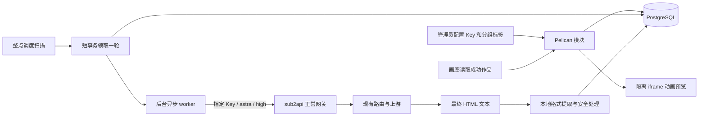

# 降智测试画廊设计方案

状态：第一版已实现并完成本地验证，默认关闭，尚未部署。更新日期：2026-09-28。配置与验证记录见 [implementation.md](implementation.md)。

代码基线：原作者 [Wei-Shaw/sub2api](https://github.com/Wei-Shaw/sub2api)，`main` / `v0.2.8`，提交 [`a3eb7ef302961cba716dc78b39b93b60c467db0e`](https://github.com/Wei-Shaw/sub2api/commit/a3eb7ef302961cba716dc78b39b93b60c467db0e)（2026-09-23）。本地已从 `32e4de794` 快进到此提交；`origin` 是用户 fork，另新增 `upstream` 指向原作者仓库。实现在 `codex/pelican-gallery` 分支，未部署服务、启用真实定时生成或调用真实 Key。

## 1. 已确定的需求

在 sub2api 中新增“降智测试”画廊，参考 <https://flow-node.com/pelican> 的动画作品卡片、分组标签和点击放大交互。以新增文件为主，把后续合并上游的冲突集中到少量注册入口。

| 项目 | 第一版约定 |
| --- | --- |
| 执行方式 | 服务端定时调度、后台异步 worker；无需打开网页 |
| 调用频率 | 每小时总共一次生成请求、一个题目、一份作品；多选分组不增加次数 |
| 凭据 | 使用管理员指定的一把 API Key，密文保存 |
| 模型 | 固定 `gpt-6-astra`，配置页只读，服务端强制 |
| 推理强度 | 固定 `high`，配置页显示“高”，服务端强制 |
| 分组 | 配置页多选；选中的分组显示为同一作品的标签 |
| 提示词 | 简短场景描述，明确只生成代码，不检查、不测试、不解释 |
| 生成之后 | 保存代码和用量；不启动浏览器验收、不评分、不调用裁判或修复模型 |
| 失败策略 | 跳过当次，不补发、不自动重试；画廊不展示失败卡片或错误页面 |
| 展示内容 | 只显示成功保存且可安全预览的 HTML/SVG 动画作品，保留已有成功作品 |
| 页面 | `/pelican` 画廊，`/admin/pelican` 独立配置页 |
| 权限 | 管理员配置；默认所有已登录用户可查看画廊 |

第一版默认关闭。题目默认三题顺序轮换，也可固定一题；历史默认保留 30 天，每页 30 条。保存、启用、刷新、翻页及放大均不立即调用模型；启用后从下一整点开始。为保持每小时一次的明确预算，第一版不增加手动生成按钮。

该功能用于人工观察生成效果，不宣称能够证明上游真实模型身份或给出可靠的“智商分数”。因为画廊按要求只展示成功作品，也不能用作品列表推算调用成功率；调用故障仍由后台记录和现有监控承担。

## 2. 最新上游核查结论

2026-09-27 已获取原作者 `main` 并核对远程 HEAD。对上述提交的文件名、源码、前端入口、迁移及相关提交记录检索 `pelican`、`gallery`、`降智`、`画廊`、`鹈鹕` 等关键词，未发现同类 HTML/SVG 定时生成画廊。README 中的“不降智”是赞助文案。

| 现有能力 | 核查位置 | 与本需求的关系 |
| --- | --- | --- |
| 账号定时测试 | `backend/internal/service/scheduled_test_runner_service.go`；`backend/migrations/066_add_scheduled_test_tables.sql` | 按 `account_id` 和 cron 调用 `AccountTestService.RunTestBackground`，保存文本、错误及延迟，可自动恢复账号；没有作品和画廊 |
| 渠道监控及 v2 | `backend/internal/service/channel_monitor_runner.go`、`channel_monitor_challenge.go`、`channel_monitor_checker.go`、`channel_monitor_v2.go` | 有后台调度、指定 Key 加密、可用性/延迟及配额数据；默认探测会生成随机加减法并校验答案，但没有 HTML/SVG 作品和画廊 |
| 异步批量生图 | `docs/BATCH_IMAGE_MVP.md` | 面向 Gemini/Vertex 图片批次；不等同于 `gpt-6-astra` 生成 HTML/SVG 代码 |
| 新插件系统 | `docs/PLUGIN_DEVELOPMENT.md`；`backend/pkg/pluginapi/v1/plugin.proto`；`backend/pkg/pluginapi/docs/ui-bridge.md` | 有独立进程、配置 UI、KV 和账号相关宿主能力；现有 UI Bridge 主要用于管理员配置/状态，未提供普通用户画廊、分组目录及任意业务路由的完整接入能力 |

最接近“验证模型响应”的现成功能是渠道监控的算术 challenge：它只检查响应中是否包含预期整数，不能替代动画作品的人工观察；自定义请求体 replace 模式还会跳过该校验。本模块不附加这类算术探测，避免在每小时生成之外增加调用。

因此采用独立 `internal/pelican` 模块，参考现有后台任务结构，直接复用认证、加密、数据库和正常网关。将当前需求塞进插件传输接口或监控结果表，会增加不相关改动。用户 fork 的 `origin/custom/main` 不作为本次原作者基线，也未混入本次更新。

## 3. 参考页与产品流程

### 3.1 参考范围

此前对参考页和用户截图的查看确认：页面采用作品网格、时间、题目、分组标签、动画预览、点击放大，刷新只读取历史。参考页提示每 10 分钟生成，并展示模型和 token 用量。本项目按用户要求改为每小时一次。

参考页预览使用 iframe，观察到 `sandbox="allow-scripts"`。本项目第一版使用无需 JavaScript 的 SVG/CSS 轻微动画，实现相同类别的动态预览和放大体验；不复制参考站品牌、源码或生成作品，不承诺每次生成的构图与原图一致。参考站后台提示词、调度及计费实现未核实，不能当作实现依据。

### 3.2 管理员配置

新增独立页面，不向现有大型设置页追加表单。

| 字段 | 默认值与行为 |
| --- | --- |
| 自动生成开关 | 默认关闭，开启安排下一整点 |
| API Key | 首次必填；密码输入，保存后只显示已配置和掩码 |
| 展示分组 | 复选框多选现有分组；可不选，不选则无分组标签 |
| 模型 / 推理强度 | 只读显示 `gpt-6-astra` / 高（`high`） |
| 生成频率 | 只读显示“每小时共生成一份” |
| 题目模式 | 三题轮换，或固定一个题目 |
| 输出 token 上限 | 默认 16,384，作为停止上限，不是每次固定消耗 |
| 超时 | 默认 300 秒，允许 60～600 秒 |
| 历史保留 | 默认 30 天，允许 7～90 天 |

分组列表复用 `frontend/src/api/admin/groups.ts` 的 `getAll()`，对应 `GET /api/v1/admin/groups/all`。配置接口校验所选 ID 存在且处于可选状态、去重保存。选择分组不要求其与模型平台相同，因为它们仅用于标签展示。

页面在分组选择区明确提示：**“每小时只生成一份，勾选的分组将作为作品标签。”** 例如勾选 A、B、C 后，15:00 仅调用一次，该作品同时显示 A、B、C 三个标签。不会循环调用三次，也不会复制成三张卡片。

标签不改变 Key 的绑定分组、模型路由、权限或计费。模型请求仍由指定 Key 的实际配置决定。标签只发布 ID 和名称，不向画廊返回账号、价格或其他分组配置；管理员勾选即表示将这些标签名称展示给画廊读者。

每轮领取时保存分组 ID/名称快照。改名或调整勾选只影响后续作品；已完成作品保留原标签。之后删除或停用的分组不再加入新作品标签，不阻断这一轮生成；历史标签仍可用于筛选。

Key 字段不提交表示保留，非空表示替换，空字符串不能覆盖已有 Key。单独的“清除 Key”操作同时关闭调度。保存使用 `revision` 防止覆盖其他管理员的修改，不以模型探测验证配置，避免多一次请求。

后台状态区可显示最近运行时间、下次计划和脱敏日志入口。失败诊断仅在管理员主动查看运行记录时出现，不把配置页替换成错误页。页面说明正常自动请求上限为 24 次/天、30 天约 720 次；不按勾选分组数相乘。

### 3.3 画廊

- 最新作品优先，桌面 3～5 列、平板 2 列、手机 1 列；每张卡片显示动画、题目、生成时间及所选分组标签。
- 点击卡片放大同一份作品；详情显示模型、推理强度、完整时间、实际 token 用量及耗时。关闭按钮和 Escape 均可退出。
- 可按题目和标签筛选；不同标签下出现的是同一作品 ID。普通画廊没有执行状态筛选和失败记录入口。
- 列表接口在数据库查询时限定成功且可展示的作品，再分页；不依赖前端把失败记录隐藏。
- 生成中不插入占位或失败卡片。一次任务失败后页面保持已有成功列表；尚无成功作品时显示“暂无作品”，不展示错误原因。
- 页面可见时每 60 秒读取列表，隐藏时暂停；刷新失败时保留当前列表，不跳转错误页。列表和产物请求的失败不触发模型请求。
- 作品预览懒加载，同时挂载的动画 iframe 建议最多 6 个，离屏卸载；放大时使用同一作品内容。
- 单份预览读取失败或因安全策略不能展示时，省略该预览/卡片，其他作品继续显示，不插入 HTML 错误页面。管理员日志用于排查。

不生成静态截图。浏览器仅在用户打开画廊时正常显示动画；这不属于生成之后运行测试，也不产生额外模型用量。

## 4. 独立模块与调用边界



第一版假定 Key 由当前 sub2api 实例签发，通过本实例 `/v1/responses` 调用。内部目的地址来自受信任服务配置，不能从浏览器 `Host` 或转发头构造；监听通配地址时转换为可达 loopback。专用 HTTP 客户端禁用环境代理和自动重定向，避免凭据流向其他目的地。

正常网关的分组、余额、配额、模型权限、IP 限制、限流及计费均继续生效。模块不直取上游账号凭据，也不使用展示标签覆盖路由分组。若指定 Key 实际属于第三方站点，再另行设计受限 Base URL 配置；当前不开放任意目标地址。

配置页和画廊接口均快速返回数据库结果。模型请求上下文来自模块生命周期及独立超时，不来自页面 HTTP 请求；关闭浏览器或切换页面不会中断生成。

## 5. 异步调度与失败处理

### 5.1 每小时一次

时间以 UTC 保存，前端按站点/浏览器时区展示。北京时间 14:25 启用，首轮计划为 15:00，随后 16:00、17:00。调度扫描间隔为 15 秒，实际开始可晚数秒。

每个时隙选一个题目，并提交最多一次模型请求。默认三题轮换，同一题目每三小时出现一次；失败也推进轮换，避免因某题失败而持续追加调用。固定题目模式每轮使用同一提示词版本。

重启不追补历史时隙：若本小时有到期任务，只考虑本小时一次；更早时隙跳过并记录数量。关闭后再启用从下一整点开始，修改配置不立即生成。数据库不可用时不领取、不发模型请求。

### 5.2 领取与 worker

单例配置、单个并发任务。使用 PostgreSQL 锁与唯一索引实现跨实例领取，不增加 Redis 队列依赖。

1. 调度器在短事务内锁定配置行，重新检查启用状态、到期时隙和运行记录。
2. 过期任务标记 `interrupted`，不重新提交；有效任务尚未结束则当前时隙记为 `skipped`，推进下次时间。
3. 插入本轮 `running` 记录，保存提示词、参数、分组和配置版本快照，以及领取令牌、租约截止时间。
4. 同一事务推进 `next_run_at` 和轮换序号，提交；自动时隙唯一索引阻止另一实例重复领取。
5. 提交后由有界后台 worker 执行 HTTP 请求；调度器不在事务中等待模型，页面接口不等待 worker。
6. worker 以 `run_id + claim_token` 条件保存终态。产物和 `succeeded` 状态必须原子提交，避免成功卡片缺少内容。

任务领取后进程退出、worker 无法启动或队列交接失败，均将本轮中断/跳过，不重新生成。租约到期只清理状态，不作为自动重试机制。每次提交前检查令牌与租约仍有效；租约失效的 worker 不得保存结果或继续发起调用。

请求硬超时默认 300 秒，租约为超时加 60 秒保存余量。关闭自动开关停止新任务，已发请求允许在原超时内结束。服务退出时先取消并等待本模块 worker，在共享数据库关闭前尽力写入中断状态。

这些约束保证本模块每个时隙最多提交一次请求，不能保证外部上游“恰好一次计费”。网关已有重试/切换或请求送达后断线可能使实际用量不确定；本模块不额外重发、不换模型、不降推理强度。

### 5.3 失败只进入后台记录

| 情况 | 后台处理 | 画廊行为 |
| --- | --- | --- |
| 正常完成且内容可安全保存 | `succeeded`，保存产物和实际用量 | 新增一张作品卡片 |
| 401/403、额度不足、模型不可用、429、5xx、网络错误 | `failed`，脱敏原因；本轮不重试 | 保留原成功列表 |
| 超时、连接中断、进程退出 | `failed` 或 `interrupted`，不重新发送 | 无失败卡片 |
| 接口报告 incomplete、空输出、超过字节上限 | `invalid_output`，不修复、不补写 | 本轮不展示 |
| 包含不允许的主动内容、无法安全提取 HTML/SVG | `preview_blocked`，保存受限诊断 | 本轮不展示 |
| 上轮仍执行 | `skipped`，不并行生成 | 保留原成功列表 |
| Key 无法解密 | 记录配置问题，不尝试其他 Key | 保留原成功列表 |

正常下一整点可继续生成。成功仅表示请求完成且有可安全展示的内容，不代表通过视觉质量、语法运行或场景正确性测试。

## 6. 固定模型请求与简短提示词

### 6.1 请求参数

仅使用 Responses 协议，不做失败后的协议回退。服务端常量强制 `model = gpt-6-astra`、`reasoning.effort = high`；配置写入接口不接受替换这两个字段。

```json
{
  "model": "gpt-6-astra",
  "reasoning": { "effort": "high" },
  "input": "写一个html，svg画鹈鹕滑雪，配上街景和轻微动画。只生成代码，不检查、不测试、不解释。仅输出完整HTML，用内联SVG和CSS，不用脚本或外链。",
  "max_output_tokens": 16384,
  "stream": true,
  "store": false
}
```

`Authorization: Bearer <指定 Key>` 仅由后端添加。后台消费 SSE，确认 `response.completed` 且响应终态为完成，只提取最终 `output_text`；reasoning、工具内容和错误对象不进入 HTML。截断流不能视为完整作品。

不提供 tools、浏览器、执行器或多轮 agent，不发送自动修复请求，不要求模型先规划、自检或输出说明。短提示词和单次生成减少额外用量；`high` 仍可能产生模型内部推理 token，不承诺绝对的速度或用量。

输出 token 上限包括推理模型的推理开销，达到上限而未完成时跳过，不补充生成。最终文本建议上限 1 MiB，完整响应累计读取上限 4 MiB；SSE 单事件明确设置容量上限。记录实际 input/output/total token 和接口提供的 reasoning/cached 明细，缺失值为 `null`。

参数字段与当前仓库 Responses 网关约定保持一致；本次未用真实 Key 验证模型可用性。指定入口不支持该模型/强度时按失败策略跳过，不自行改成别的模型。正常网关若配置了模型或推理参数改写，应使用未改写这些值的测试 Key 所属分组；展示标签不负责改变这些策略。

### 6.2 提示词模板

每个提示词由一行场景和同一条简短公共要求拼接，版本化保存，第一版不开放任意长提示词编辑器。

| 题目 ID | 场景提示词 |
| --- | --- |
| `pelican-ski/v1` | 写一个html，svg画鹈鹕滑雪，配上街景和轻微动画。 |
| `wukong-airplane/v1` | 写一个html，svg画孙悟空开飞机，配上云层和轻微动画。 |
| `polar-bear-ultraman/v1` | 写一个html，svg画北极熊骑奥特曼，配上冰原和轻微动画。 |

统一追加：

> 只生成代码，不检查、不测试、不解释。仅输出完整HTML，用内联SVG和CSS，不用脚本或外链。

不追加构图评分表、逐项验收、单元测试、自我审查或修复要求。修改提示词必须新增版本，历史记录保存完整快照与 hash，方便对比相同题目。只允许去除一层明确的 Markdown 代码围栏等格式提取，不替模型补图、改构图或补写代码。

## 7. 展示隔离，不增加生成测试

本地内容提取和安全处理不调用模型，不启动浏览器，不运行生成代码，不检查视觉效果；只保护登录面板及访客，处理时间与模型推理无关。

1. 后端通过 HTML 解析器和 CSS 词法分析器提取允许的内容并限制大小；成功作品的原始输出另存，失败轮次仅保留状态、固定诊断码及可用的用量，不存储失败源码。
2. 父页面使用现有 `apiClient` 和 JWT 获取作品 JSON。前端复用已安装的 DOMPurify，以独立策略处理 HTML/SVG。
3. 应用构造包含固定 CSP 的预览模板，填入允许的样式和图形，通过 `<iframe sandbox="" referrerpolicy="no-referrer" :srcdoc="...">` 展示。
4. 不设置 `allow-scripts`、`allow-same-origin`、表单、弹窗、下载和顶层导航权限；不把 JWT 拼进预览 URL。

允许内联绘图、渐变、裁剪、CSS 关键帧和受限 SVG 动画；内部 `#fragment` 引用需限制为允许的绘图资源。禁止脚本、事件属性、`foreignObject`、嵌套 frame/object、外部资源、跳转、表单、`base`、meta refresh、CSS `@import` 及外部 URL；动画也不能修改这些主动内容属性。

CSP 基线由应用插入，产物不能覆盖：

```text
default-src 'none'; script-src 'none'; style-src 'unsafe-inline';
connect-src 'none'; img-src 'none'; font-src 'none'; media-src 'none';
object-src 'none'; frame-src 'none'; base-uri 'none'; form-action 'none'
```

若无法在此范围安全展示，本轮跳过，不偷偷删掉主体再标为成功。原始源码仅供管理员按纯文本/JSON 读取，不通过同源可执行页面或主页面 `v-html` 展示。第一版只展示当前预览策略版本的作品；日后提升策略版本时旧作品会被省略，若需恢复展示应追加本地重新处理迁移，不调用模型。

## 8. 数据设计

使用三个独立表和原生 SQL 仓储，复用现有 PostgreSQL 连接，避免新增 Ent schema 引发大量生成文件变化。

| 表 | 主要字段与规则 |
| --- | --- |
| `pelican_config` | `id=1`、`revision`、`enabled`、`api_key_encrypted`、`selected_group_ids`（JSONB ID 数组）、`topic_mode`、`fixed_topic_id`、`rotation_sequence`、`max_output_tokens`、`timeout_seconds`、`retention_days`、`next_run_at`、`updated_by` 和时间戳 |
| `pelican_runs` | `id`、`config_id`、`config_revision`、`scheduled_for`、`status`、`claim_token`、`lease_expires_at`、题目/提示词版本/hash/完整快照、不含凭据的 `request_snapshot`、`selected_groups_snapshot`（JSONB `{id,name}` 数组）、请求/响应模型、实际用量、起止时间/耗时、固定诊断码、response ID |
| `pelican_artifacts` | `run_id` 主键及外键、`raw_output`、`preview_html`、`content_sha256`、`size_bytes`、`preview_policy_version`；原文和预览分别上限 1 MiB |

固定模型与推理强度由服务端定义，配置表不提供可变值；每轮请求快照保存其实际发送值以便追溯。Key 使用现有 `SecretEncryptor`（`backend/internal/repository/aes_encryptor.go`）加密，对外 DTO 只有 `key_configured` / `key_masked`。沿用站点持久化加密密钥配置；解密失败时停止使用该凭据并提示管理员重新配置。

索引和一致性：

- `(config_id, scheduled_for)` 唯一，防止同一小时重复领取。
- `config_id WHERE status='running'` 部分唯一，防止跨实例并发执行；锁内先处理过期记录。
- 成功记录的时间/ID 倒序索引、题目索引，以及分组快照 GIN 索引支持画廊筛选和游标分页。
- 产物和成功终态在同一事务提交；领取令牌条件更新防止过期 worker 覆盖结果。

列表只读小字段，不加载作品正文。每小时最多清理 500 条过期终态及级联产物，不清理执行中任务。原文与预览若合计 100～300 KiB/轮，720 轮约 70～211 MiB；若每轮均触及 2 MiB 上限，约 1.4 GiB，未计索引及备份。第一版不增加对象存储或截图服务。

## 9. API 与权限

复用 `/api/v1` 和现有 `{code, message, data}` 格式。所有读接口及保存配置都不发起生成请求。

| 方法与路径（省略 `/api/v1`） | 权限 | 行为 |
| --- | --- | --- |
| `GET /admin/pelican/config` | 管理员 | 脱敏配置、固定模型/强度、下次时间及配置问题 |
| `PUT /admin/pelican/config` | 管理员 | 校验 Key、分组、边界及 revision，保存；不进行模型探测 |
| `DELETE /admin/pelican/config/key` | 管理员 | 清除凭据并关闭调度 |
| `GET /admin/pelican/runs` | 管理员 | 全部运行状态及脱敏诊断，游标分页 |
| `GET /admin/pelican/runs/:id` | 管理员 | 单轮详情和不含凭据的快照 |
| `GET /admin/pelican/runs/:id/source` | 管理员 | 原始输出的 JSON 字符串 |
| `GET /pelican/status` | 登录用户 | 频率、最近成功时间、下次计划；不返回错误详情 |
| `GET /pelican/runs` | 登录用户 | 仅成功可展示作品；题目/分组筛选，默认 30 条，最大 100 条 |
| `GET /pelican/groups` | 登录用户 | 已展示作品中的标签 ID/名称，用于筛选历史标签 |
| `GET /pelican/runs/:id/artifact` | 登录用户 | 可展示的作品 JSON；非成功/受阻记录返回 404，不返回错误 HTML |

管理员路由复用现有 AdminAuth、AdminComplianceGuard、审计及面板限流；用户路由复用 JWTAuth、BackendModeUserGuard 及面板限流。写接口不能通过普通用户认证绕过管理权限。

配置及源码响应使用 `Cache-Control: no-store`；画廊接口使用 `private, no-store`。配置写入的审计不记录请求正文，管理员读取源码单独记审计。Key 明文、密文、Authorization 及上游敏感错误均不能进入审计正文、日志、请求快照或普通用户响应。接口正常的鉴权/网络错误仍使用 JSON 状态码；画廊按第 3.3 节保持已有内容，不跳转错误页。

## 10. 以新增文件为主的接入方案

实际文件结构如下；路由注册放在独立模块的 `handler.go`，配置表单直接放在独立管理页：

```text
backend/internal/pelican/
  module.go                 # 装配与 Start/Stop
  config.go                 # 配置、固定参数与脱敏 DTO
  repository.go             # 领取、状态、标签快照及清理
  runner.go                 # 整点调度和独立后台 worker
  client.go                 # 本实例 HTTP 客户端
  protocol_responses.go     # SSE 终态、最终文本和用量
  artifact.go               # 格式提取与本地安全处理
  handler.go
  prompts.go
  prompts/*.txt             # 三条简短场景与公共要求
backend/cmd/server/pelican.go
backend/migrations/241_local_pelican_gallery.sql
frontend/src/features/pelican/
  api.ts
  types.ts
  routes.ts
  navigation.ts
  locales/zh.ts
  locales/en.ts
  views/PelicanGalleryView.vue
  views/PelicanAdminView.vue
  components/PelicanCard.vue
  components/PelicanPreview.vue
  components/PelicanPreviewDialog.vue
  previewPolicy.ts
```

新增模块的必要开发测试同目录放置。现有文件只接入以下入口：

| 现有文件 | 最小修改 |
| --- | --- |
| `backend/cmd/server/wire.go` | 注入独立 provider，为 Application 增加模块字段 |
| `backend/cmd/server/wire_gen.go` | Wire 自动生成，不手工修改 |
| `backend/cmd/server/main.go` | 配置和数据库就绪后启动模块；退出时在共享 Cleanup 前停止 |
| `backend/internal/server/middleware/audit_log.go` | 配置写入省略审计正文，源码读取纳入审计 |
| `backend/go.mod`、`go.sum` | 引入 CSS 词法分析库及 Wire 所需校验和 |
| `frontend/src/router/index.ts` | 导入并展开模块路由，放在兜底路由之前 |
| `frontend/src/components/layout/AppSidebar.vue` | 追加画廊/管理入口 |
| `frontend/src/i18n/locales/zh/index.ts`、`en/index.ts` | 注册模块命名空间 |

新增 `cmd/server/pelican.go` 的 provider 接收现有 `*gin.Engine`、`*sql.DB`、配置、加密器、中间件和读取分组所需依赖，在开始监听前显式注册路由；构造函数不启动定时器，不用全局 `init()` 隐式运行任务。

不扩展公共 Handler 聚合、定时测试表或账号测试流程，不修改网关热路径。SQL 迁移按实施时最新编号新增，描述含 `local_pelican`，降低同名冲突；已部署迁移不得改写或重命名。上游按完整文件名和 checksum 记录迁移，后续演进继续追加独立文件。

这能减少冲突，不能保证零冲突。升级后主要复核上述装配入口、认证中间件和网关协议。

## 11. 实施验收与上线边界

以下验收使用 mock 响应、临时 PostgreSQL 和固定安全样例；**不加入每小时生成流水线，不逐份运行生成代码或浏览器测试，不消耗真实 Key。** 已执行项目及范围见实施记录。

| 验收场景 | 预期行为 |
| --- | --- |
| 未启用 / 未配置 Key | 零模型请求 |
| 14:25 开启，勾选 A/B/C | 15:00 附近恰好一次请求，同一作品三个标签 |
| 请求参数 | 固定 `gpt-6-astra` 和 `reasoning.effort=high`，无工具或二次请求 |
| 连续三轮 | 按版本化简短提示词轮换；每轮只生成代码 |
| 页面关闭或 HTTP 请求结束 | 后台任务继续，与页面生命周期无关 |
| 两实例扫描 / 重启 / 过期 worker | 唯一领取、无补跑、不覆盖新终态 |
| 401、429、超时、截断、无法展示 | 跳过本轮，后台诊断可查；画廊保留成功内容，无错误卡片 |
| 修改标签 / 改名 / 删除分组 | 新作品按当前有效选择快照，历史标签不变，调用次数不变 |
| 刷新 / 保存 / 翻页 / 点击放大 | 零额外模型调用 |
| 非管理员访问配置或源码 | 拒绝访问，敏感值不泄露 |
| 固定 SVG/CSS 样例与恶意样例 | 动画可预览；脚本、网络、父页面访问等受到隔离 |
| 30 条列表 / 移动端 / 深色模式 | 布局可用，离屏 iframe 卸载 |

已验证调度/事务、固定参数、SSE 终态、脱敏、成功过滤和标签快照，并用固定预览样例完成浏览器动画预览、放大、标签勾选及桌面/手机布局验证。相关 Go 测试与构建、前端组件测试、typecheck、lint 和 build 均通过。真实模型可用性及生产环境部署未验证。

上线默认关闭，由管理员配置指定 Key 和标签后启用，首轮等到下一整点。暂采用“本实例 Key、登录用户可见、HTML/SVG/CSS 动画”三个默认边界；如后续需第三方 Key、免登录开放或执行生成 JavaScript，再单独调整设计。

回退功能时关闭开关，停止新任务；只回退本功能代码时保留新增表，不执行破坏性迁移。以上不代表已批准或完成生产部署，也不保证跨越其他上游版本的数据库降级兼容性。
